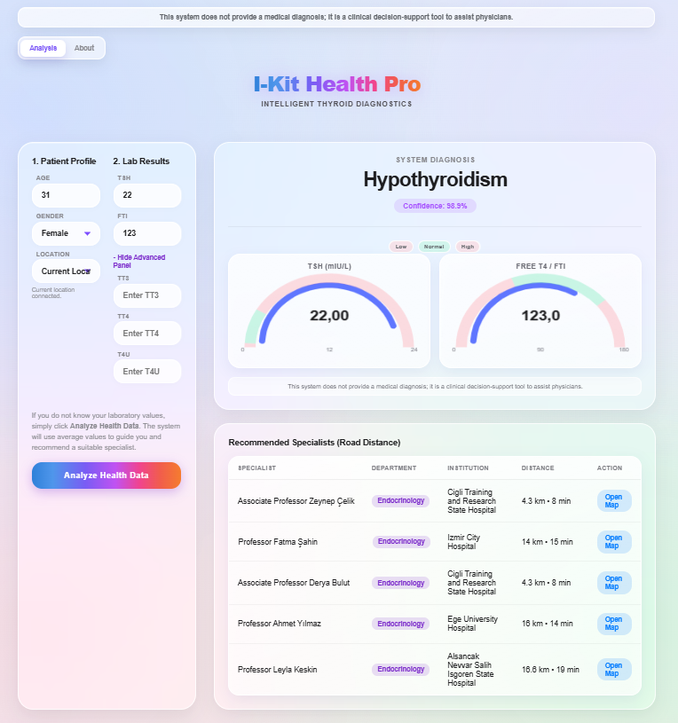
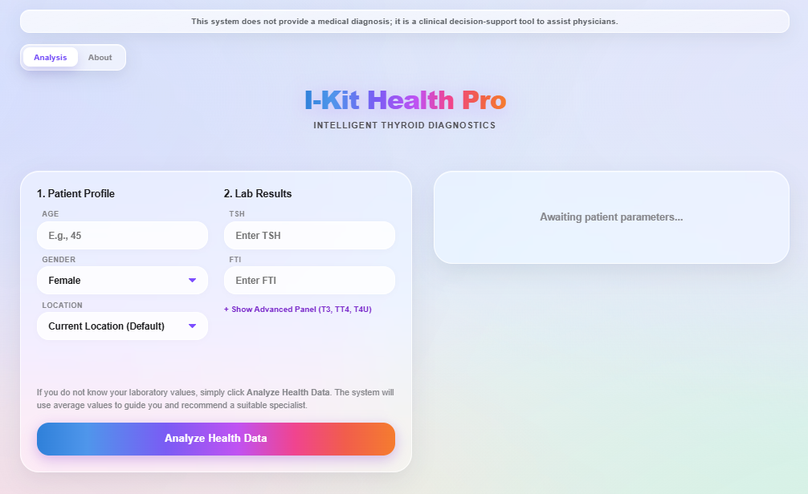

# I-Kit Health Pro

AI-assisted thyroid decision-support and specialist recommendation platform for early thyroid risk assessment.

> Space Deployment Note: This file is uploaded to Hugging Face as `README.md` to provide required Space metadata.

## Quick Start

1. Install dependencies:
   ```bash
   pip install -r requirements.txt
   ```
2. Run the Flask app:
   ```bash
   python app.py
   ```
3. Open `http://localhost:7860`

## Interface Preview

Current production interface:



### Latest UI Snapshots

Pre-analysis state (patient input and baseline layout):



Post-analysis state (diagnosis, gauges, and specialist routing table):


## Project Background

This project was developed with the scope and support framework of **TUBITAK 2209-A (University Students Research Projects Support Program)** and expanded into a deployable clinical decision-support prototype.

## Key Features

- Thyroid condition prediction (`Hyperthyroidism`, `Hypothyroidism`, `Healthy`) using CatBoost.
- Deterministic safety guardrails for critical endocrine threshold cases.
- Specialist recommendation with distance-aware ranking.
- Live routing mode with OSRM road distance and ETA fallback logic.
- Glassmorphism-inspired, responsive web interface with clinician-friendly outputs.
- Model metadata tracking and reproducible evaluation artifacts.

## Tech Stack

- **Backend:** Python, Flask, Pandas, NumPy, CatBoost, scikit-learn
- **Frontend:** HTML, CSS, JavaScript, Chart.js
- **Deployment:** Docker-ready setup

## Live Demo

- Hugging Face Space: [I-Kit Health Pro](https://huggingface.co/spaces/mertvoysal/I-Kit-Health-Pro)

## Project Structure

- `app.py` - Flask application and ML inference logic
- `templates/index.html` - user interface
- `artifacts/` - trained model and metadata
- `thyroidDF.csv` - source dataset
- `scripts/upload_to_hf_space.py` - Hugging Face Space upload helper

## Data and Usage Notice

- The dataset file (`thyroidDF.csv`) is included for research and educational demonstration in this repository.
- Before any public redistribution or product use, verify external dataset rights and licensing constraints independently.
- This repository is intended for academic/portfolio demonstration and clinical decision-support prototyping.

## Reproducibility

- Model file: `artifacts/catboost_thyroid_model.cbm`
- Metadata file: `artifacts/model_metadata.json`
- Generated evaluation outputs are intentionally excluded from version control to keep the repository clean.

## Clinical Safety Note

This system does **not** provide a definitive medical diagnosis. 
It is intended as a **clinical decision-support tool** to assist healthcare professionals.
